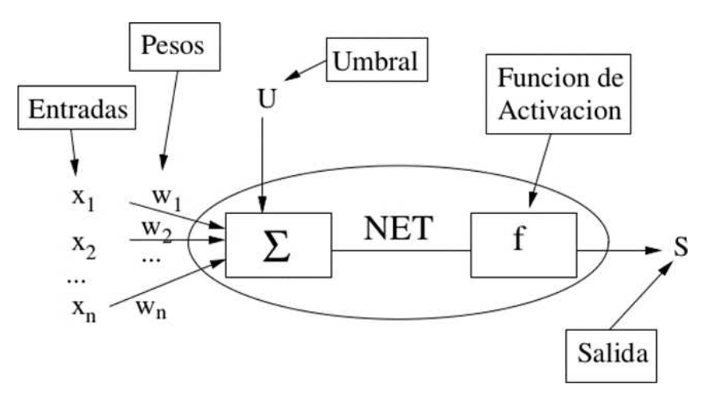
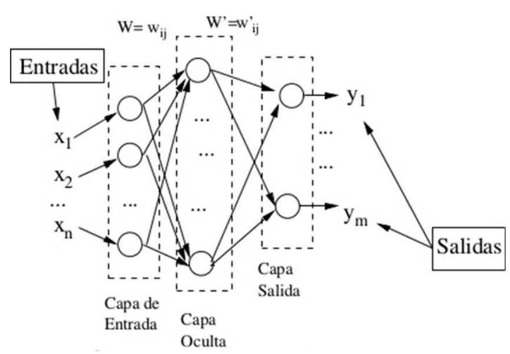
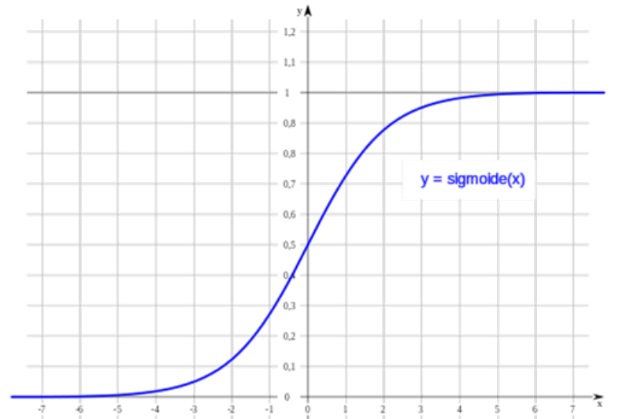
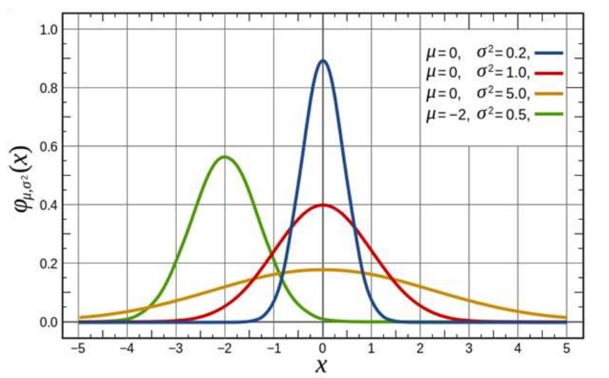

# Perceptron

## 1. Single-layer perceptron

### 1.1 Origin and basic idea

* A single artificial neuron for supervised learning, originally proposed by **Frank Rosenblatt (1957)** as a binary classifier.
* Acts as a **linear classifier**: a weighted sum decides between two classes.

### 1.2 Mathematical structure

Each neuron is defined by inputs $x_i$, weights $w_i$, a **threshold** $U$, and an activation function $f(\cdot)$.

  

$$
a = \sum_{i=1}^{n} w_i\,x_i - U
$$

The continuous output (probability) is obtained with the **sigmoid**:

$$
y = f(a) = \sigma(a) = \frac{1}{1+e^{-a}}
$$

### 1.3 Learning algorithm (sigmoid + log-loss)

1. **Initialize** weights and threshold

   * $w_i \sim [-0.5,0.5]$
   * $U   \sim [0,1]$
2. For each example $(\mathbf{x},s)$ (label $s\in{0,1}$):

   1. Compute $a=\sum w_i x_i - U$ and $y=\sigma(a)$.
   2. **Soft error:** $\delta = y - s$.
   3. **Update** parameters (gradient descent on the log-loss):

$$
\begin{aligned}
 w_i &\leftarrow w_i - \alpha\,\delta\,x_i \\[4pt]
 U   &\leftarrow U   + \alpha\,\delta
\end{aligned}
$$

3. Repeat for several epochs until the mean loss stabilises.

### 1.4 Inference

1. Compute $a$ and $y=\sigma(a)$ on test data.
2. **Threshold** (hard decision):
   $(y\ge 0.5)\Rightarrow 1$; $(y<0.5)\Rightarrow 0$.

$$

$$

## 2. **Multilayer perceptron (MLP)**

> **Core idea:** an MLP is a **composite function** $f(\mathbf{x},\theta)$ built from linear layers followed by nonlinear activations.
> Training means **minimising** a loss $L\bigl(f(\mathbf{x},\theta),\,y\bigr)$ by adjusting the **weights** $W$ and **biases** $b$ (the parameters $\theta$) with **gradient descent**.

### 2.1 Motivation

Adding one or more **hidden layers** lets the network model **non‑linear** decision boundaries and complex mappings that a single perceptron cannot represent.

### 2.2 Architecture

| Component           | Symbol                                                                                    | Formula                                                   |
| ------------------- | ----------------------------------------------------------------------------------------- | --------------------------------------------------------- |
| Inputs              | $\mathbf{x}\in\mathbb{R}^{d_0}$                                                           | —                                                         |
| Layer $l$ (1 … $T$) | Weights $W^{(l)}\in\mathbb{R}^{d_l\times d_{l-1}}$ Biases $b^{(l)}\in\mathbb{R}^{d_l}$ | $\displaystyle z^{(l)} = W^{(l)} a^{(l-1)} + b^{(l)}$     |
| Activation          | $\sigma^{(l)}$ (sigmoid, ReLU, tanh…)                                                     | $\displaystyle a^{(l)} = \sigma^{(l)}\bigl(z^{(l)}\bigr)$ |
| Final output        | $a^{(T)}$                                                                                 | $f(\mathbf{x};\theta)$                                    |

*Set $a^{(0)} = \mathbf{x}$.*
For **classification**: soft-max + cross-entropy at the top.
For **regression**: linear activation + MSE.

 

### 2.2. Loss function $L$

Example (MSE, $K$ outputs):

$$
L \;=\; \frac12 \sum_{k=1}^{K}\bigl(a^{(T)}_k - y_k\bigr)^2 .
$$

> Any differentiable $L(\text{prediction},\text{target})$ works (cross-entropy, Huber, etc.).

---

### 2.3. The **gradient** — the local “blame”

$$
\boxed{\displaystyle
\nabla_{\theta}L \;=\; \frac{\partial L}{\partial \theta}}
$$

* Points to the direction where $L$ **increases fastest** in parameter space.
* To **minimise** we step the other way:

  $$
  \theta \;\leftarrow\; \theta - \alpha\,\nabla_{\theta}L .
  $$

#### 2.3.1 Delta of a neuron

For neuron $i$ in layer $l$:

$$
\delta^{(l)}_i
  \;=\;
  \frac{\partial L}{\partial z^{(l)}_i}.
$$

*Intuition:* “How much would $L$ change if I nudge this neuron's **linear input** $z$?”

---

### 2.4. Learning algorithm (back-propagation)

1. **Forward pass**
   For each layer:
   $z^{(l)} = W^{(l)} a^{(l-1)} + b^{(l)}$,
   $a^{(l)} = \sigma^{(l)}\!\bigl(z^{(l)}\bigr)$.

2. **Backward pass**

   * **Output layer $T$**

     $$
       \delta^{(T)}
         = \underbrace{\frac{\partial L}{\partial a^{(T)}}}_{\text{direct error}}
           \;\odot\;
           \underbrace{\sigma'^{(T)}(z^{(T)})}_{\text{local slope}}
     $$
   * **Hidden layers $t = T-1,\dots,1$**

     $$
       \delta^{(t)}
         = \bigl(W^{(t+1)}\bigr)^{\!\top}\,\delta^{(t+1)}
           \;\odot\;
           \sigma'^{(t)}(z^{(t)}).
     $$

3. **Local gradients**

   * **Weights:** $\displaystyle \frac{\partial L}{\partial W^{(t)}} = \delta^{(t)}\,{a^{(t-1)}}^{\!\top}$.
   * **Biases:** $\displaystyle \frac{\partial L}{\partial b^{(t)}} = \delta^{(t)}$.

4. **Parameter update** (e.g. SGD)

   $$
   W^{(t)} \leftarrow W^{(t)} - \alpha\,\frac{\partial L}{\partial W^{(t)}},
   \qquad
   b^{(t)} \leftarrow b^{(t)} - \alpha\,\delta^{(t)}.
   $$

*(Some notes swap signs by defining the error as $y_{\text{target}} - o$; in that convention you write “$+\alpha\,\text{input}\,\delta$” instead — numerically identical.)*

---

### 2.5. What each term does

| Symbol                            | Practical meaning                                              |
| --------------------------------- | -------------------------------------------------------------- |
| $a$                               | Signal moving **forward**.                                     |
| $\sigma'$                         | Local sensitivity of the neuron.                               |
| $W^{\top}\delta$                  | Distributes **blame** from a layer to the previous one.        |
| $\delta$                          | Gradient = blame per neuron, travels **backwards**.            |
| $a^{\text{prev}}\!\times\!\delta$ | Gradient of an individual weight (blame × traffic through it). |

---

### 2.6. Popular optimisers

| Method   | Key idea                                            |
| -------- | --------------------------------------------------- |
| SGD      | Fixed step in (–) gradient direction.               |
| Momentum | Exponential average of gradients (smoother).        |
| RMSProp  | Divide by √(historical variance) (scale-adaptive).  |
| Adam     | Momentum **and** RMSProp combined (robust default). |

$$
.$$

## 3. Activation functions

| Type         | Formula                                   | Graphic                                                         |
| ------------ | ----------------------------------------- | --------------------------------------------------------------- |
| **Linear**   | \$f(a)=a\$                                | —                                                               |
| **Sigmoid**  | \$\displaystyle f(a)=\frac{1}{1+e^{-a}}\$ |  |
| **Gaussian** | selective for intermediate values         |    |
| **ReLU**     | \$f(a)=\max(0,a)\$                        | —                                                               |

---
