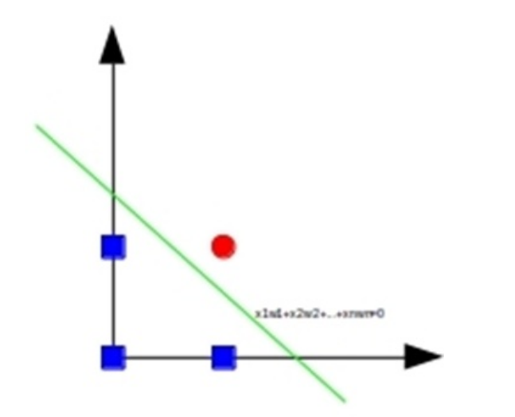
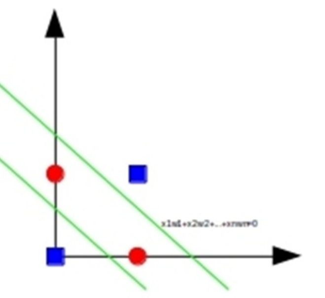

# Perceptrón

## 1. Perceptrón simple

### 1.1 Origen e idea básica  
* Una única neurona artificial para aprendizaje supervisado, propuesta originalmente por **Frank Rosenblatt (1957)** como clasificador binario para reconocimiento de patrones en imágenes 2-D.   
* Se comporta como **clasificador lineal**: la activación de la neurona decide entre dos clases. 

### 1.2 Estructura matemática  
Cada neurona está definida por: entradas $x_i$, pesos $w_i$, un **umbral** $U$ y una función de activación $f(\,\cdot\,)$.  

$$
a=\sum_{i=1}^{n} w_i\,x_i - U
$$

$$
y=f(a)
$$

La figura original ilustra el modelo:  

Si $f$ es la función escalón:

$$
f(a)=
  \begin{cases}
    1 & \text{si } a\ge 0\\
    0 & \text{si } a<0
  \end{cases}
$$

### 1.3 Algoritmo de aprendizaje (regla del perceptrón)  

1. **Inicializar** pesos $w_i$ y umbral $U$ (normalmente aleatorios). 
    * $w_i$ --> [-0.5, 5]
    * $U$ --> [0, 1]
2. Para cada ejemplo $(\mathbf{x},s)$:
     
   * Calcular la salida $y$.  
  
   * Si $y\neq s$, **actualizar**:  
     $$
     w_i \leftarrow w_i + \alpha\,(s - y)\,x_i,\qquad  
     U \leftarrow U - \alpha\,(s - y)
     $$

3. Repetir hasta que el error sea aceptable o se alcance el criterio de parada.   

### 1.4 Separabilidad lineal  
El valor de entrada $a$ define un **hiperplano** que separa ambas clases en $\mathbb{R}^n$. Ejemplo con la función lógica **AND** (linealmente separable):  

Para problemas **no linealmente separables** (p.ej. XOR) el perceptrón simple **no converge**:  

## 2. Perceptrón multicapa (MLP)

### 2.1 Motivación  
Añadir capas intermedias («ocultas») permite aprender funciones **no lineales**, superando la limitación del perceptrón simple. 

### 2.2 Arquitectura  
* Varias capas totalmente conectadas; la información **siempre se propaga hacia delante**.  
* La última capa suele contener una neurona por clase (clasificación multiclase).  

### 2.3 Aprendizaje por retro-propagación  
* Tras producir la salida, se calcula el **error** (p. ej. error cuadrático medio $E$).  
* Se propaga el error de atrás hacia delante, actualizando pesos con **descenso del gradiente**:  

$$
w_{ij} \leftarrow w_{ij} - \alpha\,\frac{\partial E}{\partial w_{ij}}
$$

* Requiere funciones de activación **no lineales y derivables** (sigmoide, ReLU, etc.).  

## 3. Funciones de activación citadas
| Tipo | Forma/Propósito |
|------|-----------------|
| Lineal | $f(a)=a$ |
| Umbral (escalón) | decisión binaria |
| Sigmoide | $f(a)=\dfrac{1}{1+e^{-a}}$ | 
 |
| Gaussiana | Selectiva a valores intermedios | 
 |

## 4. Resumen rápido de fórmulas claves
* **Agregación:** $a=\sum w_i x_i - U$  
* **Salida binaria:** $y=f(a)$ (escalón)  
* **Actualización simple:** $w_i \leftarrow w_i + \alpha(s-y)x_i$, $U \leftarrow U - \alpha(s-y)$  
* **Gradiente (MLP):** $w \leftarrow w - \alpha\,\nabla E$
